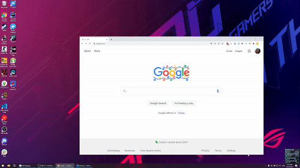

# RectangleWin

A minimalistic Windows rewrite of macOS
[Rectangle.app](https://rectangleapp.com)/[Spectacle.app](https://www.spectacleapp.com/).
([Why?](#why))

A hotkey-oriented window snapping and resizing tool for Windows.

This animation illustrates how RectangleWin helps me move windows to edges
and corners (and cycle through half, one-thirds or two thirds width or height)
only using hotkeys:



## Install

1. Go to [Releases](https://github.com/ahmetb/RectangleWin/releases) and
   download the suitable binary for your architecture (typically x64).

2. Launch the `.exe` file. Now the program icon should be visible on system
   tray!

3. Click on the icon and mark as "Run on startup" to make sure you don't have
   to run it every time you reboot your PC.

## Keyboard Bindings

- **Snap to edges** (left/right/top/bottom ½, ⅔, ⅓):
  - <kbd>Win</kbd> + <kbd>Alt</kbd> + <kbd>&larr;</kbd><kbd>&rarr;</kbd><kbd>&uarr;</kbd><kbd>&darr;</kbd>
  - Press multiple times to alternate between ½, ⅔ and ⅓.

- **Corner snapping**
  - <kbd>Win</kbd> + <kbd>Ctrl</kbd> + <kbd>Alt</kbd> + <kbd>&larr;</kbd>: top-left ½, ⅔ and ⅓
  - <kbd>Win</kbd> + <kbd>Ctrl</kbd> + <kbd>Alt</kbd> + <kbd>&uarr;</kbd>: top-right ½, ⅔ and ⅓
  - <kbd>Win</kbd> + <kbd>Ctrl</kbd> + <kbd>Alt</kbd> + <kbd>&darr;</kbd>: bottom-left ½, ⅔ and ⅓
  - <kbd>Win</kbd> + <kbd>Ctrl</kbd> + <kbd>Alt</kbd> + <kbd>&rarr;</kbd>: bottom-right ½, ⅔ and ⅓

- **Center window** on the display: <kbd>Win</kbd>+<kbd>Alt</kbd>+<kbd>C</kbd>

- **Maximize window**: <kbd>Win</kbd>+<kbd>Shift</kbd>+<kbd>F</kbd>

  (Obsolete since Windows natively supports <kbd>Win</kbd>+<kbd>&uarr;</kbd>)

## Why?

It seems that no window snapping utility for Windows is capable of letting
user snap windows to edges or corners in {half, two-thirds, one-third} sizes
using configurable **shortcut keys**, and center windows in a screen like
Rectangle.app does, so I wrote this small utility for myself.

I've tried the native Windows shortcuts and PowerToys FancyZones and they
are not supporting corners, alternating between half and one/two thirds, and
are not offering enough hotkey support.

## Roadmap

- Configurable shortcuts: I don't need these and it will likely require a pop-up
  UI, so I will probably not get to this.

## Development (Install from source)

With Go 1.17+ installed, clone this repository and run:

```sh
go generate
GOOS=windows go build -ldflags -H=windowsgui .
```

The `RectangleWin.exe` will be available in the same directory.

## License

This project is distributed as-is under the Apache 2.0 license.
See [LICENSE](./LICENSE).

If you see bugs, please open issues. I can't promise any fixes.
